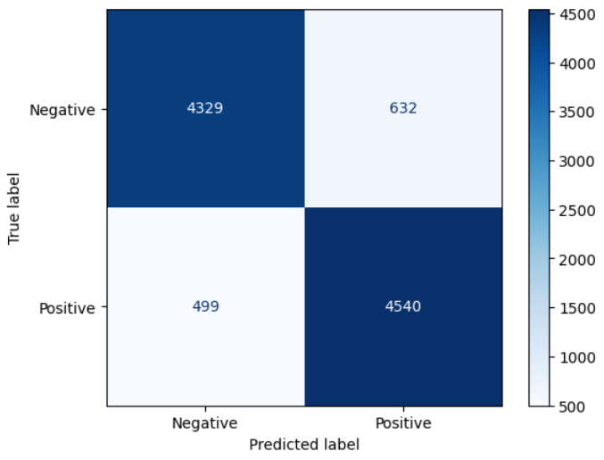
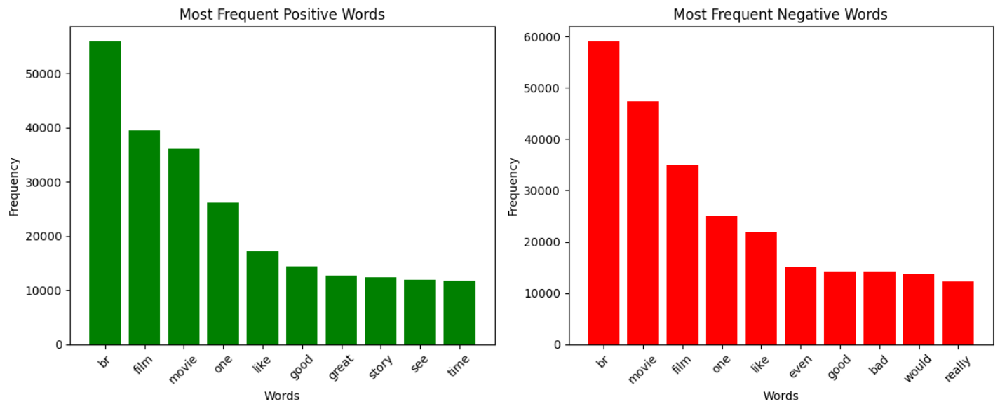

# 📊 Sentiment Analysis on IMDb Reviews

This project is a Natural Language Processing (NLP) application that classifies IMDb movie reviews into positive or negative sentiment using machine learning models.

---

## 🚀 Project Overview

- **Goal**: Build a sentiment classifier for movie reviews.
- **Dataset**: IMDb Movie Reviews (50,000 samples)
- **Approach**: Preprocess text → Vectorize using TF-IDF → Train ML classifiers → Evaluate & visualize results
- **Techniques Used**: OOP design, TF-IDF, Logistic Regression, Naive Bayes, performance evaluation

---

## 📁 Dataset

The dataset used is the IMDb Movie Reviews dataset (50,000 labeled reviews).

Since the file exceeds GitHub’s file size limits, you can download it from:
🔗 [Google Drive - IMDb Dataset](https://drive.google.com/file/d/1VF7Uleu-wzKIqLwlCEmEt_nAM2cvI7tD/view?usp=drive_link)

Or download it directly from the official source:  
🔗 [Kaggle IMDb Dataset](https://www.kaggle.com/datasets/lakshmi25npathi/imdb-dataset-of-50k-movie-reviews)

---

## 🧠 What I Did

- Cleaned and preprocessed raw text (lowercasing, stopword removal, punctuation removal)
- Converted text to numeric vectors using **TF-IDF**
- Trained two classifiers:
  - `Logistic Regression`
  - `Multinomial Naive Bayes`
- Evaluated models using Accuracy & F1-Score
- Visualized results
- Implemented full pipeline using **Object-Oriented Programming (OOP)**

---

## 📊 Visualizations

This project includes the following visualizations:

- Confusion Matrix for both classifiers
- Most Frequent Positive Words (Bar Chart)
- Most Frequent Negative Words (Bar Chart)

Examples:

  
  


---

## 🗂️ Project Structure

```bash
.
├── sentiment_analysis.ipynb   # Main notebook (OOP-based)
├── README.md                  # Project documentation
├── /images                    # Visual results
```

---

## 📎 How to Run

1. Install required libraries:
```bash
pip install pandas scikit-learn nltk matplotlib seaborn
```

2. Download the dataset from the Google Drive or Kaggle link above

3. Run the notebook:
```bash
jupyter notebook sentiment_analysis.ipynb
```
Or use [Google Colab](https://colab.research.google.com) and mount your Google Drive

---

## ✍️ Author

**Mostafa Abbas Saleh**  
AI Student | NLP Enthusiast

---

## 🙏 Acknowledgment

Thanks to Elevvo for the learning experience during the internship program.
